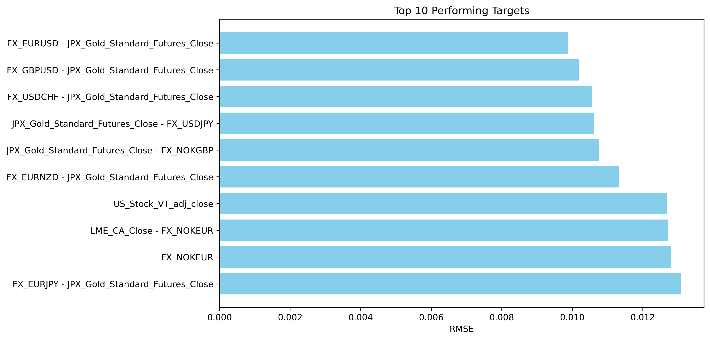

# Cross-Market Predictive Research: FX, Commodities & Equities

## Project Overview
This project explores **predictive relationships across FX, commodity futures, and equity markets**.  
The aim was to test whether **machine learning models** can uncover signals that could later be used for **algorithmic trading strategies**.

The workflow followed the same steps as in a trading desk research environment:
- Generating trading ideas from cross-market data  
- Building and tuning models  
- Backtesting predictive performance with realistic validation  
- Ranking instruments by signal strength  

---

## Approach
- **Data**: FX pairs, Gold Futures (JPX), LME metals, and global equities  
- **Model**: Gradient boosting (XGBoost) with GPU acceleration  
- **Tuning**: Automated hyperparameter search with Optuna  
- **Validation**: Walk-forward style (TimeSeriesSplit) to avoid lookahead bias  
- **Metric**: Root Mean Squared Error (RMSE) as a proxy for forecast accuracy  

---

## Results
The models identified **strong predictive links between Gold Futures and major FX pairs**.

**Top 10 Targets by Predictive Accuracy (lowest RMSE):**

---

## Key Insights
- There is **clear predictive structure** between Gold Futures and FX pairs — suggesting potential cross-market trading signals.  
- The framework can be **re-used and extended** to test energy commodities (power, gas, oil) with the same approach.  

---
